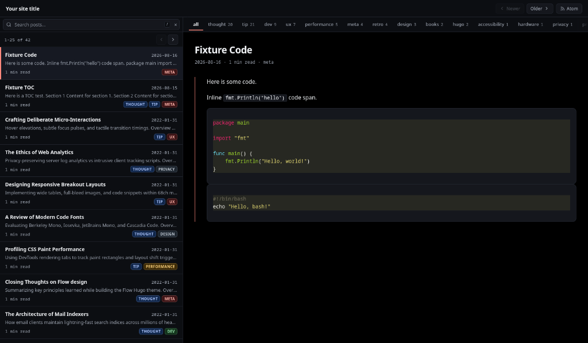

# ⚡ Flow

> **A high-performance Hugo theme crafted like a desktop mail client.**  
> Posts are messages. Tags are labels. Read seamlessly with an interactive split-pane interface.

[](https://flow-kv9i.onrender.com/)
[](https://gohugo.io/)
[](LICENSE)
[](https://gohugo.io/)
[](https://pagefind.app/)
[](#design--typography)

[](https://flow-kv9i.onrender.com/)

[**🔗 Explore the Live Demo →**](https://flow-kv9i.onrender.com/)

---

## 🌟 Why Flow?

Most blog themes force readers into a repetitive cycle: scroll an index, click a post, read, click back, scroll again, and repeat.

**Flow reimagines blogging through the familiarity and efficiency of a desktop mail client** (think Superhuman, Apple Mail, or Fastmail). The screen splits into a persistent, scrollable message list on the left and a distraction-free reading pane on the right. Readers can browse your entire archive, filter by labels, and jump between articles instantly—without ever losing their place or context.

Whether you're writing technical deep-dives, development logs, essays, or daily notes, **Flow gives your readers a premium, snappy, native-app feel backed by 100% static HTML.** Experience it firsthand at [flow-kv9i.onrender.com](https://flow-kv9i.onrender.com/).

---

## ✨ Features at a Glance

### 📬 Desktop Mail Client Interface
* **Persistent Split-Pane Architecture**: Browse your post list while reading articles side-by-side.
* **Draggable & Resizable Splitter**: Custom drag-and-drop divider with smooth pointer capture, real-time `--sidebar-width` styling, double-click to reset, and keyboard controls (`←`/`→`/`Home`/`End`).
* **Instant Width & Scroll Memory**: Persists divider width and message list scroll position in `localStorage`/`sessionStorage` with zero Layout Shift (CLS).
* **Infinite Scroll & Virtualized Lists**: Dynamic `IntersectionObserver` loads older posts seamlessly; CSS `content-visibility: auto` guarantees silky 60fps scrolling even with hundreds of posts.
* **Mobile-Responsive Adaptation**: Gracefully transforms on viewports `<1000px` into an intuitive single-pane flow with smooth back navigation.

### 🔍 Lightning-Fast Static Search (Pagefind)
* **Instant Full-Text Search**: Live 120ms debounced search indexes titles, summaries, and full post bodies.
* **In-Place Sidebar Results**: Search results render directly in the message list with matching query highlights (`<mark>`) without clearing the active reading pane.
* **Global Keyboard Shortcuts**: Press `/` or `Cmd+K` / `Ctrl+K` to search from anywhere, `Esc` to restore the list, and `Enter` to open the top result.
* **Zero Initial Overhead**: Dynamically lazy-loads the Pagefind search bundle on first focus or hover.

### 🏷️ Intelligent Taxonomy & Tag Strip
* **Horizontal Tag Selector**: Quick-filter strip in the sub-bar displaying post counts with smooth keyboard scrolling.
* **Pinned Tags**: Showcase your primary categories (e.g., `thoughts`, `engineering`, `tutorials`) right at the front via `site.Params.pinnedTags`.
* **Deterministic M3 Color Chips**: Tags are hashed via 32-bit FNV-1a into 8 Material Design 3 contrast-checked color pairs in both Go templates and JS.
* **Instant Client-Side Filtering**: Clicking any tag dynamically updates the sidebar list via background fetch without reloading the page.
* **Dedicated Tags Directory**: Built-in `/tags/` overview page listing all taxonomies sorted by post count.

### 🖼️ Modern Next-Gen Media Pipeline
* **Automatic Format Delivery**: Smart `<picture>` and `<video>` generation with fallbacks:
  * **Static Raster**: Visual-lossless JPEG XL (`.jxl`) with automatic WebP dynamic generation and original format fallbacks.
  * **Animated GIFs**: Transcoded to ultra-lightweight WebM (`.webm`) looping `<video>` tags with GIF fallback.
  * **Vectors**: Native SVG passthrough.
* **Markdown Render Hooks**: Standard Markdown syntax `` automatically leverages the modern media processor.
* **`modern_image` Shortcode**: Rich media embedding with captions, custom classes, intrinsic width/height, lazy loading, and breakout styling.
* **Automated Transcoder Script**: Build-time incremental media transcoding script (`scripts/transcode-media.sh`) using `cjxl` and `ffmpeg`.

### ⚡ Zero-Toolchain Asset Pipeline
* **No npm / Tailwind / PostCSS / Sass required**: All bundling, `@import` resolution, CSS nesting, and JS minification are handled natively by Hugo Extended's built-in esbuild engine.
* **Subresource Integrity (SRI)**: Asset pipelines generate fingerprinted CSS and JS bundles with cryptographic integrity hashes.
* **Instant Chroma Syntax Highlighting**: Clean code blocks with dark and light themes rendered natively with Hugo's `css.ChromaStyles`.

### ♿ Accessibility & Modern Web Standards
* **AMOLED Dark Theme by Default**: Deep black canvas with Material Design 3 surface elevations, paired with an automatic, high-contrast light mode (`prefers-color-scheme: light`).
* **Semantic HTML5 & Landmarks**: Accessible structure (`<header>`, `<nav>`, `<main>`, `<article>`) with full ARIA attributes and skip-to-content links.
* **Modern Typography**: System-native font stacks with modern CSS `text-wrap: balance` on headings and `text-wrap: pretty` on body copy.
* **View Transitions API**: Seamless cross-document MPA page transitions for modern browsers.
* **Syndication Ready**: Built-in Atom 1.0 and RSS feeds with auto-discovery tags and toolbar subscription buttons.

---

## ⌨️ Keyboard Shortcuts

Flow is designed keyboard-first for power users and writers:

| Key / Shortcut | Context | Action |
| :--- | :--- | :--- |
| <kbd>/</kbd> | Global | Focus & select search input |
| <kbd>Cmd</kbd> + <kbd>K</kbd> / <kbd>Ctrl</kbd> + <kbd>K</kbd> | Global | Focus & select search input |
| <kbd>Escape</kbd> | Search Box | Clear query & restore full message list |
| <kbd>Enter</kbd> | Search Box | Open first search result |
| <kbd>←</kbd> / <kbd>→</kbd> | Resizer Divider | Adjust sidebar width by 16px |
| <kbd>Home</kbd> / <kbd>End</kbd> | Resizer Divider | Snap sidebar to minimum (320px) or maximum width |
| <kbd>Enter</kbd> / <kbd>Space</kbd> | Resizer Divider | Reset sidebar to default width (500px) |
| <kbd>Tab</kbd> / <kbd>Shift</kbd> + <kbd>Tab</kbd> | Tag Strip | Traverses tags (auto-scrolls focused tag into view) |

---

## 🚀 Quick Start

### Prerequisites
* **Hugo Extended** `>= 0.165.0` (required for `css.ChromaStyles` and `importContext`).
  ```sh
  hugo version
  # Example output: hugo v0.165.0+extended ...
  ```

### Installation

#### Option 1: As a Git Submodule (Recommended)
Inside your Hugo site directory:
```sh
git submodule add https://github.com/BiosPlus/flow.git theme/flow
```
Add Flow to your `hugo.toml`:
```toml
theme = "flow"
```

#### Option 2: Clone Directly
```sh
git clone https://github.com/BiosPlus/flow.git theme/flow
```

---

## 🛠️ Development

Run the Hugo development server with the `--disableFastRender` flag:

```sh
hugo server --disableFastRender
```

> [!IMPORTANT]
> The `--disableFastRender` flag is **mandatory** during local development. Because Flow embeds the message list and pagination context across pages, fast render may serve stale sidebar lists when navigating between posts.

---

## ⚙️ Configuration

Here is a recommended `hugo.toml` configuration:

```toml
baseURL = "https://example.com/"
locale = "en-us"
title = "My Flow Blog"
publishDir = "build"
themesDir = "theme"
theme = "flow"

# Pagination
[pagination]
  pagerSize = 25

# Taxonomies
[taxonomies]
  tag = "tags"

# Flow Theme Parameters
[params]
  # Site description displayed in toolbar and empty states
  description = "Reflections on systems, software engineering, and craft."

  # Pinned tags displayed prominently at the beginning of the tag strip
  pinnedTags = ["engineering", "thoughts", "design"]

  # Fallback pager size matching pagination.pagerSize
  pagerSize = 25

# Markup & Code Highlighting
[markup]
  [markup.highlight]
    noClasses = false
    lineNos = false
    tabWidth = 2
    wrapperClass = "highlight"
  [markup.goldmark.renderer]
    unsafe = false
  [markup.tableOfContents]
    startLevel = 2
    endLevel = 3

# Atom & RSS Syndication
[mediaTypes]
  [mediaTypes."application/atom+xml"]
    suffixes = ["xml"]

[outputFormats]
  [outputFormats.Atom]
    mediaType = "application/atom+xml"
    baseName = "atom"
    rel = "alternate"
    isPlainText = false

[outputs]
  home = ["html", "Atom", "rss"]
  section = ["html", "Atom", "rss"]
  taxonomy = ["html", "Atom", "rss"]
  term = ["html", "Atom", "rss"]
```

---

## 📝 Writing Content

Create new articles inside `content/posts/`:

```markdown
+++
title = "Building Fast Static Interfaces"
date = 2026-08-19T10:00:00Z
description = "A deep dive into zero-layout-shift UI architecture."
tags = ["engineering", "web", "performance"]
toc = true
+++

Here is the opening paragraph of your article. Flow styles typography with balanced line lengths, crisp contrast, and a distinct left accent guide-line.

## Subheading

You can write standard Markdown as usual.

### Code Blocks with Syntax Highlighting

```go
package main

import "fmt"

func main() {
    fmt.Println("Flow is lightning fast!")
}
```

### Modern Images & Captions

Standard Markdown images are automatically enhanced:


Or use the dedicated `modern_image` shortcode for advanced options:



### Breakout Data Tables

Tables automatically wrap in breakout containers with horizontal scrolling:

| Feature | Support | Performance |
| :--- | :---: | :---: |
| Split-Pane | Native | 60 FPS |
| Pagefind | Full-Text | < 10ms |
| JPEG XL / WebM | Native Fallbacks | 40-70% Smaller |
```

---

## 🚀 Production Build & Search Indexing

Flow uses **Pagefind** to deliver blazing fast, static full-text search. A complete production build involves compiling Hugo and generating the search index:

```sh
# 1. (Optional) Transcode media assets to JXL / WebM
bash ./scripts/transcode-media.sh

# 2. Build and minify the static site with Hugo Extended
hugo --gc --minify

# 3. Generate the Pagefind search index
npx -y pagefind --site build
```

### Automated CI/CD (Render / Vercel / Netlify / GitHub Actions)
The included [`build.sh`](build.sh) script automatically sets up Hugo Extended, checks toolchain checksums, transcodes media, builds the site, and indexes with Pagefind.

---

## 📂 Project Structure

```text
flow/
├── assets/                  # Site-level media assets
│   └── images/              # Source images (.png, .jpg, .gif)
├── content/
│   └── posts/               # Blog posts organized by year/month
├── scripts/
│   └── transcode-media.sh   # Incremental JXL & WebM media optimization script
├── theme/
│   └── flow/                # Flow theme directory
│       ├── assets/          # Native CSS and JS asset pipeline
│       │   ├── css/         # Design tokens, shell, reading, list, chips, chroma
│       │   └── js/          # resize.js, scroll-memory.js, search.js
│       └── layouts/         # Semantic templates, partials, markup render hooks
├── build.sh                 # Production CI/CD build script
├── hugo.toml                # Site configuration
└── README.md
```

---

## 🎨 Customizing Styles

Flow's design system is controlled via CSS custom properties in [`tokens.css`](theme/flow/assets/css/tokens.css). You can easily override:
* `--bg`: Background color for the reading pane (default AMOLED `#000000`).
* `--surface`: Surface container background for sidebar, toolbar, and sub-bar.
* `--accent`: Primary highlight color for active tabs, left guide-lines, and resizer handles (default `#ff897d`).
* `--focus`: Accessible focus ring color (`#a8c7fa`).
* `--font` & `--font-mono`: System typographic stacks.

---

## 📄 License

Distributed under the [MIT License](LICENSE). Built by [BiosPlus](https://github.com/BiosPlus).
